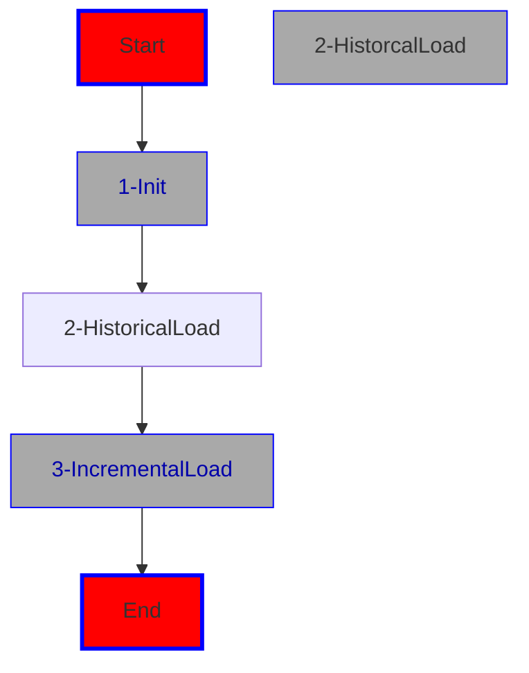

# bundle_adb_360

The 'bundle_adb_360' project deploys jobs, which in turn build the lakehouse with bronze, silver and gold.
The necessary data points are created by the mimesis package, which synthesizes data sets. 

Firstly, the jobs have to be installed. This is done via the pipeline bundle_adb_360/pipelines/azure/init-pipeline.yml. This pipeline needs to be installed in ADO as usual.
But before this is being done, you need to adjust some variables in bundle_adb_360/databricks.yml:

* in the variables section replace all the defaults with the current values (if you are in the dev phase, prod values aren't known yet)
* in the variables section for the environments (dev,prod) adjust the variables for 
    * dev:
        * adjust bronzestorageaccountname
    * prod:
        * adjust bronzestorageaccountname
        * adjust catalogname
        * adjust schemaname

 

This installs the bundle and the workflows, which in turn do the following:

There's three workflows:
* init: the contents of this folder is going to set up the UC Volume on the bronze exteranl location

* historical: contains the notebooks for a historical load including the synthetic generation of test data with the help of Mimesis, a Python package. The historical load entails:
    * creating test data via Mimesis on bronze as parquet files (four tables)
    * creating a silver UC database/schema with the tables to be filled from bronze Parquet as Delta
    * creating a gold UC database/schema and loading the historical data changes via delta's Change Data Feed feature from silver to gold including reformatting the tables/schemas to a Kimball star design with SCD Type 1 and 2 dimensions

* incremental: contains the notebooks for the incremental load, such as 
    * creating the incremental data sets with inserts and updates
    * applying the incremental data set to silver delta via merge commands with watermarking
    * using the Change Data Feed capabilities of Delta to incrementally load the star on gold with SCD type 1 and 2 load as well as the fact table load
