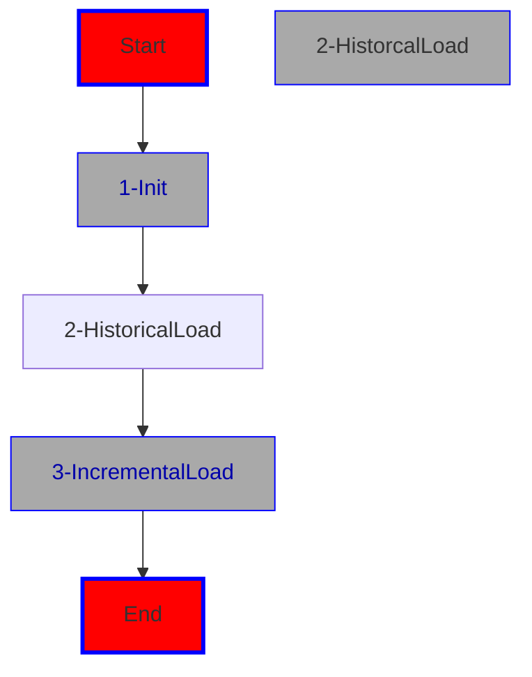

# bundle_adb_360

The 'bundle_adb_360' project deploys jobs, which in turn, via notebooks, build the lakehouse with bronze, silver and gold.
The necessary data points are created by the mimesis package, which synthesizes data sets. 

Firstly, the jobs have to be installed. This is done via the pipeline bundle_adb_360/pipelines/azure/init-pipeline.yml. This pipeline needs to be installed in ADO as usual 10.
But before this is being done, you need to adjust some variables in bundle_adb_360/databricks.yml:

* run_as:
    * adjust the service_principal_name with the appid of the adb ineteraction service principal

* variables:
    * bronzestorageaccountname: name of the storage account for bronze volume (the one that starts with dlg2dev...)
    * emailrecipient: an email address of your choice
    * devworkspace: workspace url for dev https://*workspaceurl*
    * prdworkspace: as soon as it's known
    * username: appid of the adb interaction service principal
    * catalogname: the catalog for dev (catadb360dev)
    * schemaname: the name of the dev schema (schemaadb360dev)

* in the variables section for the environments (dev,prod) adjust the variables for 
    * dev:
        * bronzestorageaccountname: name of the storage account for bronze volume (the one that starts with dlg2dev...)

        * workspace:
            * host: workspace uri in dev
    * prod:
        * bronzestorageaccountname in prod restource group
        * catalogname for prod
        * schemaname for prod
        * host: host uri for production

 

This installs the bundle and the workflows, which in turn do the following:

There's three workflows, which should be run in the following order:

* adb360_init_job: this job is creating the catalog, schema and bronze volume

* historical: contains the notebooks for a historical load including the synthetic generation of test data with the help of Mimesis, a Python package. The historical load entails:
    * creating test data via Mimesis on bronze as parquet files (four tables)
    * creating a silver UC database/schema with the tables to be filled from bronze Parquet as Delta
    * creating a gold UC database/schema and loading the historical data changes via delta's Change Data Feed feature from silver to gold including reformatting the tables/schemas to a Kimball star design with SCD Type 1 and 2 dimensions

* incremental: contains the notebooks for the incremental load, such as 
    * creating the incremental data sets with inserts and updates
    * applying the incremental data set to silver delta via merge commands with watermarking
    * using the Change Data Feed capabilities of Delta to incrementally load the star on gold with SCD type 1 and 2 load as well as the fact table load

 
And after this pipeline was successfully run, you should see something like this under workflows in the Databricks workspace:

These workflows have to be run in order:
1. adb360-_init_job
2. adb360_historical_load_job
3. adb360_incremental_load_job

