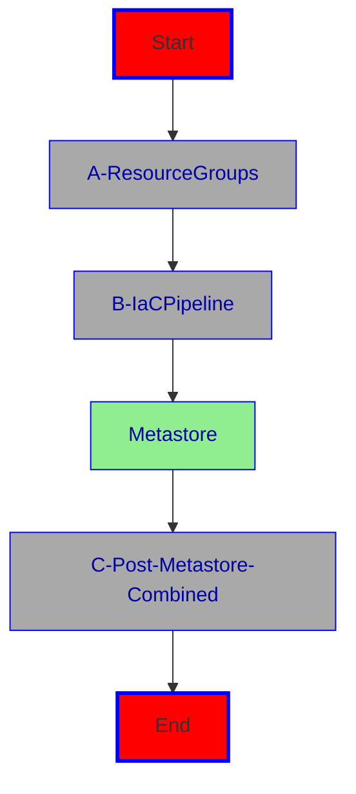

> Note: Throughout the following readme, you'll find superscripts like <sup>1</sup>, which refer to a walkthrough number in the folder /walkthroughs. So for examples the superscript <sup>1</sup> would refer to /walkthroughs/01_create a forek.

# 0. Preparation Work

## Development Workstation

<details>
  <summary>Installation of Dev Workstation</summary>

In order to adjust the code for your deployment and/or to make any other code changes, you need to have your own development workstation. One way to dot this would be a Linux workstation, since the pipelines are most likely going to run on a Linux pipeline agent and the deployment scripts are all written in bash. So in order to be able to debug these scripts locally, which you can do in VScode with the 'bashdbg' extension installed, it's best to have your workstation hosting one of the following:
* Linux (ubuntu 22.04 and higher)
* WSL (windows subsystem for Linux also with ubuntu 22.04 and higher)
* Mac OS
* Codespaces in Github (currently ubuntu 20.04.6 LTS)

The scripts have been and are being developed on a Windows 11 workstation with WSL 2 and ubuntu 24.04 installed.


Following, we describe the process to install a Linux VM on Azure and connect it via a VSCode tunnel to a local installation of VSCode. But again, this is not mandatory, you can also direct edit in Github or using the other aforementioned tools.

These are the steps to install the VM:
> Note: not all steps are necessary, depending on your environment.
1. Create a Resource Group
2. You can either use the default setttings during installation for the network or create a VNet with at least one subnet and a subnet mask /27, which can host up to 27-5=22 ip addresses.
3. Create a virtual machine with Ubuntu 22.04 or 24.04 and put it into this subnet and add a public interface. Use a key file (more secure) and use JITA (just in time access)
4. Install the following on the VM
    - Install Azure CLI : 
    ```bash
      curl -sL https://aka.ms/InstallAzureCLIDeb | sudo bash
    ```

    - Install Bicep to Azure CLI : 
    ```bash
      az bicep install
    ```
    - Install Databricks CLI > 0.230 : 
    ```bash
      curl -fsSL https://raw.githubusercontent.com/databricks/setup-cli/main/install.sh | sudo sh
    ```
    - Install Code CLI : 
    ```bash
      sudo snap install --classic code
    ```

5. Create a code tunnel on your VM and connect vscode.dev to it
    - create a tunnel on your vm
    ```bash
      code tunnel
    ```
    this is going to start the vscode server and create a tunnel. At the end, there's going to be a url output, which you copy and use to connect vscode.dev to it.
    
    - copy the url into your browser. You'll be prompted to log in to Github. Once yo're logged in, you can access your remote machine directly from vscode.dev

6. To connect our new VM to github. We create a ed25519 key
    ```bash
      ssh-keygen -t ed25519 -C "your email"
    ```
    - add it to the ssh agent
    ```bash
      eval "$(ssh-agent -s)"
      ssh-add ~/.ssh/id_ed25519
    ```
    - and add the public key to your Github organization (settings)

    <br/>

Now you're ready for the next step...


</details>

<br/>
<br/>


# 1. Default Installation (no SCC)

We support CICD either with ADO (Azure DevOps) or GA (Github Actions). ADO as well as GA share some installation steps and in others they differ.
The following describes the CICD installation for both. The specific steps for ADO or GA, you'll find in the respective headers: 
* ADO (for Azure DevOps)
* GA (for Github Actions)
* ADO=GA (for the common steps for GA as well as ADO)


## Installation of DEV Environment


### Pre ADO-GA - Installation of Prerequisites

<details>
  <summary>Click to expand</summary>

A default installation of Databricks uses public ip addresses. If you don't want public ip addresses, you'll have to either do a simplified or a standard secure cluster configuration(SCC) installation. The standard secure cluster configuration (SCC) is supported and described [here](/iac-adb-360/README.md#2-scc-secure-cluster-connectivity-installation).

Firstly, you need to fork <sup>1</sup> this repository (github.com/Azure/Databricks360) into your github organization and if you want to be able to make changes to the code, then clone <sup>2</sup> the repo locally. Change to the newly created directory, which should be something like /Databricks360. If you forked from the main branch, create a dev branch either in Github or by entering 'git checkout -b dev' at the command line. This will create a dev branch from main and check it out. By entering git push --set-updstream origin/dev you push the newly created branch onto github. It is also a good practice to set the dev branch as the default one, so that subsequent creations of new pipelines draw from dev by default.

This part, you only need, if you want to employ development via a main trunk branching strategy. It's not mandatory for setting things up. Since the dev or main branch is not protected yet, you can use the dev branch directly:

This project employs a main trunk branching strategy, where you have a dev and a main branch, which refer to the dev and prd environments. These branches (dev,prd) should be protected, so that you cannot push directly to them. Instead, before you start developing, you:
* move to the dev branch (verify with git status or git checkout dev)
* issue a git pull (to get the latest changes)
* create a feature branch for your development by issuing git checkout -b *feature/initials-whatisintented* (where initials denote the initials of the developer and whatisintended contain one word of what this feature intends to implement. This is of course just a proposal for feature naming)
* then you start developing what you intended and after the development in the feature is being done and tested, a pull request (PR) to dev is initiated
* after a successful merge the feature should be deleted and dev contains the new code
* dev is then deployed to the dev environment
* after the development environment is successfully tested
* a pull request from dev to main is initiated
* with the new contents in main updated, main is then deployed to prod


Secondly, you need to create a two service principals in your tenant (Microsoft Entra ID) <sup>3</sup>:
* service principal 'devops-sc' (App Registration) used for the service connection in Azure Devops (ADO), which serves as the security context for the devops agent, running your pipelines
* service principal 'adb360-sp' (App Registration) used for interaction with the Azure Databricks worspace and account (UC, more to this later). 


Thirdly, we need a project in ADO (Azure DevOps) to host the deployment pipelines. <sup>4</sup> And within this project, we need three service connections :
1. service connection *ado-sc* pointing to devops-sc <sup>5</sup>
2. service connection adb-sc pointing to adb360-sp <sup>5</sup>
3. service connection gh-sc pointing to your Github repo <sup>6</sup>

<br/>

</details>

### ADO-GA: Installation Overview:



The installation happens in three steps:

### A. ADO-GA

<details>
  <summary>Click to expand</summary>

1. **Resource Groups** <br/>
Sometimes you do not have the subscription wide permission to install resource groups. Therefore you might get the resource groups already precreated for you. This first step/script mimics this and installs the basic infrastructure such as the Resource Groups and assigns the necessary permissions for the two service principals, you created earlier. The user, running this script, needs to have either contributor and user access admin or owner permissions on the subscription, or as mentioned before, the resource groups would have already been precreated together with the necessary permissions for the service accounts.

    1.1. before running the script (/iac-adb-360/helpers/rg-create.sh), make sure to open the script in an editor and edit the values for the following:
   
    1.1.1. **solutionname** - a name, which qualifies your solutions. Allow it to be between 4 and 8 letters due to restrictions with Storage Account names etc. It is mainly used to uniquefy your artifacts
    
    1.1.2. **location** - the region/datacenter, where to install everything to
   
    1.1.3. **subscriptionid** - the subscription id of the subscription, you want to install into
   
    1.1.4. **serviceprincipalname** - the name of the service principal (app registration), you created in step 1.1
   
    1.1.5. **adbinteractprincipalname** - the name of the service principal, that is going to be used to interact with the Databricks workspace
   
    1.1.6. **locationshortname** - an abbreviation for your datacenter/region. p.ex. wus2 for westus3, eus for eastus etc. This is to help keep your resource names short.

    1.2. Run the script rg-create.sh from the command line p.ex 'bash ./iac-adb-360/helpers/rg-create.sh'. Make sure, you're already logged into your subscription. <sup>7</sup>

> What the script does: <br/>
  The script takes the solution name (provided earlier) and adds the date in the form 'mmdd' as well as rg- as prefix and -dev and -prd as suffix. These names are then used to generate the resource group names for the two resource groups dev and prd. After checking, that resource groups with the same names don't already exist, the resource groups are created as well as the two role assignments for the service connection: Contributor and User Access Administrator for the ADO ('devops-sc'). The Databricks interaction service principal (adb360-sp) will have to have just Contributor permissions assigned to it.
  <br/>
  Result:
  

This concludes the preliminary configuration. From here on Azure pipelines take over.

</details>

<br/>

### B. Configure the IaC pipeline to install the basic artifacts:

<br/>

### 2.1. **ADO**

<details>
  <summary>Click to expand</summary>

In Azure Devops (ADO), you need a project, usually under an organization, to configure and run the necessary pipelines. So from here it is assumed, that an organization and project exists in ADO and you navigated to it with your browswer.


2.1.1. configure the service connections <sup>5</sup> in the ADO project via Project Settings/Service Connection to be using the app registration/service principal from 1.1 (devops-sc) and also the adb interaction sp (adb360-sp). Name them ado-sc and adb-sc. Also create a third service connection to github (where you're repo is located) with a github token and named gh-sc. You have now three service connections in ADO:

* ado-sc
* ado-sp
* gh-sc

<br/>

>  there's a bash script sc-create.sh, which can help you with that. you need to add the necessary secrets before running the script though

2.1.2 add the pipeline found under /iac-adb-360/pipelines/azure/deploy-iac.yml as a pipeline in ADO. Make sure to use your Github repo as the source, choose existing yaml pipeline from the 'dev' branch with the filename /iac-adb-360/pipelines/azure/deploy-iac.yml

2.1.3 edit the config yaml files found in /iac-adb-360/pipelines/azure/configdev.yml and configprd.yml to reflect the correct Resource Group name and location. 


>If you run the pipeline for the first time, you might have to give it permission to run in the dev environment. Just watch out on the pipeline run and give the permission if asked to. You only need to do this once. The mentioned environment is an environment in ADO (under pipelines/Environments). We need two: dev and prd. If you want, you can assign security as needed. It is good to precreate these environments and assign permission to the pipelines by clicking on the environemnt/Security and under Pipeline permissions you either click + for adding the pipelines of the triple dots for open access to all pipelines.

2.2. run the pipeline

After this pipeline has been run, it should have installed the basic infrastructure. Next there's a few provisions to be made concerning the Metastore:

IaC Pipeline Result in ADO:


IaC Pipeline Result in Azure:


This ends the IAC part for ADO and you can proceed to **Metastore**.


<br/>

</details>

### 2.3 **GA**

<details>
  <summary>Clisk to Expand</summary>

<br/>
In Github, you'll need a repo. The Fork, that you created earlier can be  the Github repository from which you'll work. After the fork, you might want to set the default branch to 'dev'. The variables and secrets, that we need for our Github Actions to work are configured in an Github environment. For the dev environment, we create an enironment such as 'dev':


2.3.1 Create the GH Environment with the needed Secrets

After opening the new environment (dev), we first have to create four secrets (click on 'Add environment Secret'):
* ADB360_CREDENTIALS - these are the credentials for the adb360-sp service principal, that you should have create earlier. These credentials have to be added in the following format:
```
{
  "clientId": "<appid>",
  "clientSecret": "<secret>",
  "subscriptionId": "<subscriptionid>",
  "tenantId": "<tenantid>",
  "activeDirectoryEndpointUrl": "https://login.microsoftonline.com",
  "resourceManagerEndpointUrl": "https://management.azure.com/",
  "activeDirectoryGraphResourceId": "https://graph.windows.net/",
  "sqlManagementEndpointUrl": "https://management.core.windows.net:8443/",
  "galleryEndpointUrl": "https://gallery.azure.com/",
  "managementEndpointUrl": "https://management.core.windows.net/"
}
```
Click on 'Add Environment Secret' and in the appearing dialog enter the name (ADB360_CREDENTIALS) and in the lower part, the complete snippet from above (including the curly braces) after setting the clientid, clientsecret, subscriptionid and tenantid

* AZURE_CREDENTIALS - these are the credentials for the devops-sc service principal, which should also have been created earlier. Click on 'Add Environment Secret' -> Enter 'AZURE_CREDENTIALS' and into the lower box the complete json snippet, this time for devops-sc

* CLIENT_SECRET - this is the secret for ADB36-SP. Again click 'Add Environment Secret' and into the upper box, you enter 'CLIENT_SECRET' and into the lower, you copy the secret

* GH_PAT - here you enter the Github Personal Access token, which you can create here:


Then click on settings, scroll down to 'Developer Settings', then open 'Personal Access Tokens' and then create  'Fine-grained tokens' 


Create a token, name it and add permissions to your repo:
* Actions - Read and Write
* Metadata - Read Only

After you created the token, copy it to a secure location and add it as an environment secret to you repo named 'GH_PAT'.

You should see now these environment secrets:


Now create the necessary environment variables for the first pipeline to be able to run:
* BASE_NAME - create a variable in the dev environment named BASE_NAME and containing 'adb360'
* RESOURCE_GROUP - create another variable and add the dev resource group name as the value

Now your environment variables should look like this:


2.3.2 Run the Github Workflow

First, you need to enable the Github workflows contained in the repo. In order to do that, you'll have to set the dev branch as the default branch via 'Settings':


Now click on 'Actions' and 'I understand my workflows, go ahead and enable them'


Now, you should see something like this:


Click on 'Deploy-IAC' and then on 'Run-Workflow'. This is then going to run the 'Deploy-IAC' github actions. This should start the workflow, which in turn installes the basic infrastructure:


Or as a diagram:


Great ! Now you're done with the basic infrastsructure deployment and you can proceed to the Metastore.

</details>

<br/>
<br/>


### ADO+GA -  Metastore

> **Metastore** <br/>
Since there can only be one metastore per region and a user with GlobalAdmin role in the hosting tenant is needed to initialize a metastore, we assume, that a metastore has already been created or is being created centrally within the organization. In fact, since November 2023, if you create a new Databricks workspace and you hadn't used Unity Catalog so far, a metastore is automatically created in the respective region and the workspace is assigned to it.
We also need to make sure, that preferrably, a group something like 'uc-metastore-owners' (name doesn't matter) had been created, which should contain the adb interaction service principal from 1.1, that interacts with Databricks ('adb360-sp'). In order to do that, create the group, add the service principal to the 'service principals' in accounts/users and add the service principal to the group. Also make sure, that the metastore owner (globaladmin) is a member of this group. Then make this group the Metastore Admins by navigating to Catalog->Workspace->Configuration. This group will be from then on the admin group for the metastore. Also for the dev catalog, and later for the prd catalog, which are going to be created by pipelines later, add a group devcat-admins and prdcat-admins, which are going to hold the admins for the dev catalog and the prd catalog. These groups need to preexist, since they are going to be granted some permissions by the various pipelines. <br/>
In addition the Databricks interaction account needs to be account admin. (set this in accounts-service principals-service principal account admin). Like this, you have delegated management of the metastore to the group containing the globaladmin and the Databricks interaction service account (adb360-sp). Earlier in the process, the script which created the Resource Groups (rg-create.sh), should have added the service principal for Adb interaction as Contributor to the Resource Groups.
After verification, that these groups/permissions/role assignments are in place, you can continue with the next step. <p/>
Now the metastore should exist in the region and is fully configured to be able to continue.
If you need to install all the metastore etc. let yourself be helped by this walkthrough <sup>8</sup>

<br/>

### C. Postmetastore Installation

**ADO**
---

<details>
  <summary>Click to Expand</summary>

Next, configure and run the pipeline found in 'pipelines/azure/deploy-postmetastorecombined.yml', which does the following:

* assigns the Content Repo 'Databricks360' to the workspace. The repo is assigned under the service principal, not a regular workspace user, for automated deployment to work
* creates the catalog and the schema with on its own storage account
* creates an external location also on its own storage account
and here goes:

3. **Configure and run the pipeline deploy-postmetastorecombined.yml**


3.1. configure a variable group <sup>9</sup> with the name 'vgdevadb360' for the cluster pipeline /pipelines/azure/deploy-postmetastore.yml with the following:

3.1.1. **resourcegroupname** - name of the resource group

3.1.2. **tenantid** - id of Entra Instance

3.1.3. **clientid** - id of application id to interact with Databricks workspace (adb360-sp)

3.1.4. **clientsecret** - secret of app id to interact with Databricks workspace (configured as secret)

3.1.5 **metastorename** - the name of the metastore

3.1.6 **repourl** - the url to the content repo, which should be attached. Something like https://github.com/<orgname>/Databricks360.git

3.1.7 **credname** - the credential name for the storage credential for bronze. Thats just a name p.ex. devcreds. This is going to be the storage credential, which is pointing to the accessconnector id in the resource group both for the bronze storage account as well as the <env>catalog account.

3.1.8 **env** - the environment we're in. (dev, uat, prd etc.)

3.1.9 **bronzestorageaccountname** - the storage account name for the bronze files

3.1.10 **catalogstorageaccountname** - the storage account name for the catalog for this environment.

3.1.11 **accessconnectorid**  - the resource id of the access connector id to be used for access to catalog and bronze files storage accounts

3.1.12 **ghuser** - the git user name used

3.1.13 **ghpat** - the personal access token used to access git

3.2. create a pipeline from /pipelines/azure/deploy-postmetastore.yml 

3.3. assign the pipeline permissions to the variable group created earlier (library)

3.4. run the pipeline. make sure, to run it from the dev branch

<br/>


> make sure, that the uc-metastore-owners group exists as the metastore owners and that the adb interaction sp is one of the members


After the successful run of this pipeline, you should see:

the repo is added under the interactive user account (adb360-sp) in the workspace
the catalog and schema on the different storage account


the Storage-Credentials


and the two External Locations - cat and bronze


This concludes the IaC part <sup>Demo1</sup> ! All the installations and configurations for dev are completed now and you can start working with the [Databricks Asset Bundles for Dev](/bundle_adb_360/README.md)

</details>


**GA**
---
<details>
  <summary>Click to Expand</summary>

Next, configure and run the workflow found 'PostMetastoreCombinedDeploy', which does the following:

* assigns the Content Repo 'Databricks360' to the workspace. The repo is assigned under the service principal, not a regular workspace user, for automated deployment to work
* creates the catalog and the schema with on its own storage account
* creates an external location also on its own storage account
and here goes:

4. **Configure and run the workflow 'PostMetaStoreCombinedDeploy**


First, you need to set environemnt secrets and variables as follows:


4.1.1. **resourcegroupname** - name of the resource group (should be already set)

4.1.2. **TENANT_ID** - id of Entra Instance

4.1.3. **CLIENT_ID** - id of application id to interact with Databricks workspace (adb360-sp)

4.1.4. **CLIENT_SECRET** - secret of app id to interact with Databricks workspace (configured as secret)

4.1.5 **METASTORE_NAME** - the name of the metastore

4.1.6 **REPO_URL** - the url to the content repo, which should be attached. Something like https://github.com/<orgname>/Databricks360.git

4.1.7 **CRED_NAME** - the credential name for the storage credential for bronze. Thats just a name p.ex. devcreds. This is going to be the storage credential, which is pointing to the accessconnector id in the resource group both for the bronze storage account as well as the <env>catalog account.


4.1.8 **BRONZE_STORAGE_ACCOUNT_NAME** - the storage account name for the bronze files

4.1.9 **CATALOG_STORAGE_ACCOUNT_NAME** - the storage account name for the catalog for this environment.

4.1.10 **ACCESS_CONNECTOR_ID**  - the resource id of the access connector id to be used for access to catalog and bronze files storage accounts

4.1.11 **GH_USER** - the git user name used

4.1.12 **GH_PAT** - the personal access token used to access git (already set in secrets)


Your secrets and variables in the environment should look like this:

Secrets:


Variables:


Run the workflow 'PostMetastoreCombinedDeploy' in Github. After the successful run of this pipeline, you should see:

the repo is added under the interactive user account (adb360-sp) in the workspace
the catalog and schema on the different storage account


the Storage-Credentials


and the two External Locations - cat and bronze


This concludes the IaC part <sup>Demo1</sup> ! All the installations and configurations for dev are completed now and you can start working with the [Databricks Asset Bundles for Dev](/bundle_adb_360/README.md)


</details>

<br/>
<br/>


# Installation of the PRD - Environment


After everything, infrastructure as well as the asset bundle had been installed to dev, you can progress to the prd (Production) environment installation.

The Resource Group for prd should have been already created via the helper script rg-create.sh (see 1. Resource Groups).

Since we have already a successfully installed and configured dev environment, to install the production environemnt is as easy as:

* Running the deploy-iac pipeline from the main branch
* cloning the variable group vgdevadb360 to vgprdadb360 and adjusting the production values such as:
  * access connector resource id from prd resourcce group
  * bronzestorageaccountname
  * catalogstorageaccountname
  * credname as prdcreds
  * env
  * resourcegroupname
* since the metastore has already been created for dev, run the pipeline deploy-postmetastore.yml from the main branch
* run the boostrap-ucdbs.yml from the main branch

That should be it for the production environment infrastructure and you can proceed to the [Databricks Asset Bundles for Prd](/bundle_adb_360/README.md)

<br/>
<br/>


# 2. SCC (Secure Cluster Connectivity) Installation

In 1, you learned how to install an Azure Databricks workspace etc. the default way. This 'default' way has the disadvantage of being less safe as it uses public ip addresses. This is not a problem per se, but in the context of threat modeling, this exposes risks, since a public network interface is potentially visible from the internet and therefore attackable.
In order to avoid any public interface, there is a NPIP or No Public IP Address configuration or in short secure cluster connectivity (SCC). Within SCC, there's the simplified and standard installation. The difference between these two is, that the standard adds a transit network to separate compute plane traffic from user traffic into different vnets. This part 2 explains how to do a standard SCC installation with the transit network, as described [here](https://learn.microsoft.com/en-us/azure/databricks/security/network/classic/private-link-standard).


>Note: the installation via Github Actions is not yet implemented

## Installation via ADO (Azure DevOps) - Dev Environment

The beginning of the installation here is the same as in part 1 until you create the resource groups. So creating the service principals ado-sc, adb-sc and gh-sc remain the same.
Then this time we're going to create three Resource groups
* one for the virtual network for the Azure Databricks workspace, storage accounts etc.
* one for the virtual network for the transit network, which is used for the users to be able to access the compute plane
* and one for the resources like Azure Databricks workspace, storage accounts etc.

The reason behind creating three Resource Groups, is 
* to separate the network configuration from the other solution artifacts. More often than not, network installation and configuration is done by a different team or department within the organization and with this separation we support this scenario. You'd only need to omit the networking installation in the bicep script.
* by adding two different vnets, we can have different dns name resolutions for the compute plane and for the transit network. Usually in the compute plane, you can use the Azure resolver, whereas in the transit network usually users from the organization are connecting and therefore on prem dns might be used.
<br/>
<br/>


### 2.1.1 Installation of Resource groups

The script, which does that for us is in ./helpers/rg-create-scc-std.sh. And like in part 1, before running this script, you'll have to adjust a few variables according to your environment. So open the file rg-create-scc-std.sh in an editor and adjust:

2.1.1.1 **solutionname** : a name, which qualifies the solution, here adbsccstd. Adjust it to your liking. This name is added to all artifacts like storage account names, Databricks workspace etc. for uniqueness reasons.

2.1.1.2 **location** : in which region to install to here westus2. 

2.1.1.3 **subscriptionid** : the guid of the subscription, you want to install into

2.1.1.4 **serviceprincipalname** : the service principal name for the Azure Devops pipelines to use

2.1.1.5 **adbinteractiveprincipalname** : the service principal name for the account, which interacts with all things Databricks

2.1.1.6 **locationshortname** : as short name for the region, in order to keep resource names short (wus2 for westus2, eus for eastus, wus for westus etc.)

> This script creates three resource groups and sets the necessary permissions for the two service principals (see part 1) with this result: 


### 2.2.1 Installation of ADO pipeline to install the vnets, workspace, storage accounts etc.

First, similar as in part 1, we have to create a variable group in azure devops library called vgadb360sccdev with the following values:

2.2.1.1 **basename** : use the same as in the resource group creating script for solutionname p.ex. adbsccstdmmdd. Make sure to add the month date information of the newly created Resource Groups.

2.2.1.2 **pw** : the password for the virtual machines being created

2.2.1.3 **env** : name the environment here dev. marked as secret (click lock)

2.2.1.4 **location**: location/region where to deploy to. 

2.2.1.5 **resourcegroup** : name of the resource group

2.2.1.6 **vnetresourcegroup** : name for resource group with vnets

2.2.1.7 **transitresourcegroup** : name of the resource group with transit artifacts

2.2.1.8 **vnetname** : the name of the Databricks vnet


2.2.2 Create the pipeline in ADO from /iac-adb-360/pipelines/azure/deploy-iac-scc.yml and run it

You should get something similar to the following artifacts created in the resource groups (the date portion might differ):

* rg-\<loc\>-\<solutionname>-dev

* rg-\<location\>-\<solutionname\>-net-dev

* rg-\<location\>-\<solutionname\>-trans-dev


