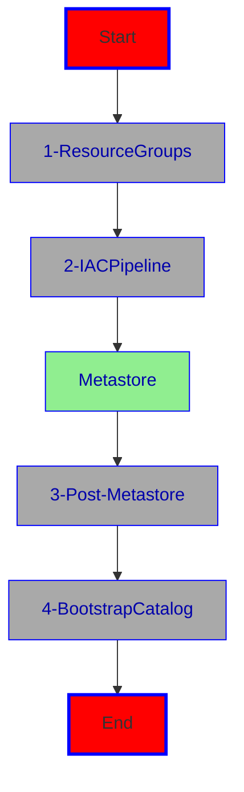

# Installation with Azure Devops (ADO) - DEV Environment

Firstly, you need to fork 1 this repository (github.com/Azure/Databricks360) into your github organization and then clone 2 the repo locally. Change to the newly created directory, which should be something like /Databricks360. If you forked from the main branch, create a dev branch either in Github or by entering 'git checkout -b dev' at the command line. This will create a dev branch from main and check it out. By entering git push --set-updstream origin/dev you push the newly created branch onto github. It is also a good practice to set the dev branch as the default one, so that subsequent creations of new pipelines draw from dev by default.

This project employs a main trunk branching strategy, where you have a dev and a main branch, which refer to the dev and prd environments. These branches (dev,prd) should be protected, so that you cannot push directly to them. Instead, before you start developing, you:
* move to the dev branch (verify with git status or git checkout dev)
* issue a git pull (to get the latest changes)
* create a feature branch for your development by issuing git checkout -b feature/initials-whatisintented (where initials denote the initials of the developer and whatisintended contain one word of what this feature intends to implement. This if of course just a proposal)
* after the development in the feature is being done and tested, a pull request (PR) to dev is initiated
* after a successful merge the feature should be deleted and dev contains the new code
* dev is then deployed to the dev environment
* after the development environment is successfully tested
* a pull request from dev to main is initiated
* with the new contents in main updated, main is then deployed to prod

Secondly, you need to create a two service principals in your tenant (Microsoft Entra ID) 3:
* service principal 'devops-sc' (App Registration) used for the service connection in Azure Devops (ADO), which serves as the security context for the devops agent, running your pipelines
* service principal 'adb360-sp' (App Registration) used for interaction with the Azure Databricks worspace and account (UC, more to this later). 
 
 

### Installation Overview:

The installation happens in four steps:

1. **Resource Groups**  
Sometimes you do not have the subscription wide permission to install resource groups. Therefore you might get the resource groups already precreated for you. This first step/script mimics this and installs the basic infrastructure such as the Resource Groups and assigns the necessary permissions for the two service principals. Therefore the user, running this script, needs to have either contributor and user access admin or owner permissions on the subscription or as mentioned before the resource groups would have already been precreated together with the necessary permissions for the service accounts.

    1.1. before running the script (/iac-adb-360/helpers/rg-create.sh), make sure to open the script in an editor and edit the values for the following:
   
    1.1.1. **solutionname** - a name, which qualifies your solutions. let it be between 4 and 8 letters due to restrictions with Storage Account names etc. It is mainly used to uniquefy your artifacts
    
    1.1.2. **location** - the region/datacenter, where to install everything to
   
    1.1.3. **subscriptionid** - the subscription id of the subscription, you want to install into
   
    1.1.4. **serviceprincipalname** - the name of the service principal (app registration), you created in step 1.1
   
    1.1.5. **adbinteractprincipalname** - the name of the service principal, that is going to be used to interact with the Databricks workspace
   
    1.1.6. **locationshortname** - an abbreviation for your datacenter/region. p.ex. wus2 for westus3, eus for eastus etc. This is to help keep your resource names short.

    1.2. Run the script rg-create.sh from the command line p.ex 'bash ./iac-adb-360/helpers/rg-create.sh'. Make sure, you're already logged into your subscription. 4

> What the script does:  
  The script takes the solution name (provided earlier) and adds the date in the form 'mmdd' as well as rg- as prefix and -dev and -prd as suffix. These names are then used to generate the resource group names for the two resource groups dev and prd. After checking, that resource groups with the same names don't already exist, the resource groups are created as well as the two role assignments for the service connection: Contributor and User Access Administrator for the ADO ('devops-sc'). The Databricks interaction service principal (adb360-sp) will have to have just Contributor permissions assigned to it.
   
  Result:
  

 
2. Configure the IaC pipeline to be run from within ADO

 

2.1. **ADO**

 

In Azure Devops (ADO), you need a project, usually under an organization, to configure and run the necessary pipelines. So from here it is assumed, that an organization and project exists in ADO and you navigated to it with your browswer.

2.1.1. configure the service connections 5 in the ADO project via Project Settings/Service Connection to be using the app registration/service principal from 1.1 (devops-sc) and also the adb interaction sp (adb360-sp). Name them ado-sc and adb-sc. Also create a third service connection to github (where you're repo is located) with a github token and named gh-sc. You have now three service connections in ADO:

* ado-sc
* ado-sp
* gh-sc

 

>  there's a bash script sc-create.sh, which can help you with that. you need to add the necessary secrets before running the script though

2.1.2 add the pipeline found under /iac-adb-360/pipelines/azure/deploy-iac.yml as a pipeline in ADO. Make sure to use your Github repo as the source, choose existing yaml pipeline from the 'dev' branch with the filename /iac-adb-360/pipelines/azure/deploy-iac.yml

2.1.3 edit the config yaml files found in /iac-adb-360/pipelines/azure/configdev.yml and configprd.yml to reflect the correct Resource Group name and location. 

>If you run the pipeline for the first time, you might have to give it permission to run in the dev environment. Just watch out on the pipeline run and give the permission if asked to. You only need to do this once. The mentioned environment is an environment in ADO (under pipelines/Environments). We need two: dev and prd. If you want, you can assign security as needed. It is good to precreate these environments and assign permission to the pipelines by clicking on the environemnt/Security and under Pipeline permissions you either click + for adding the pipelines of the triple dots for open access to all pipelines.

2.2. run the pipeline

This pipeline should have installed the basic infrastructure. Next there's a few provisions to be made concerning the Metastore:

IaC Pipeline Result in ADO:

IaC Pipeline Result in Azure:

 
 

> **Metastore**  
Since there can only be one metastore per region and a user with GlobalAdmin role in the hosting tenant is needed to initialize a metastore, we assume, that a metastore has already been created or is being created centrally within the organization. 
We also need to make sure, that preferrably, a group something like 'uc-metastore-owners' (name doesn't matter) had been created, which should contain the adb interaction service principal from 1.1, that interacts with Databricks ('adb360-sp'). In order to do that, create the group, add the service principal to the 'service principals' in accounts/users and add the service principal to the group. Also make sure, that the metastore owner (globaladmin) is a member of this group. Then make this group the Metastore Admins by navigating to Catalog->Workspace->Configuration. This group will be from then on the admin group for the metastore. Also for the dev catalog, and later for the prd catalog, that are going to be created by pipelines later, add a group devcat-admins and prdcat-admins, which are going to hold the admins for the dev catalog and the prd catalog. These groups need to preexist, since they are going to be granted some permissions by the various pipelines.  
In addition the Databricks interaction account needs to be account admin. (set this in accounts-service principals-service principal account admin). Like this, you have delegated management of the metastore to the group containing the globaladmin and the Databricks interaction service account (adb360-sp). Earlier in the process the script, that created the Resource Groups (rg-create.sh), should have added the service principal for Adb interaction as Contributor to the Resource Groups.
After verification, that these groups/permissions/role assignments are in place, you can continue with the next step. 

Now the metastore should exist in the region and is fully configured to be able to continue.

 

Next, configure and run the pipeline found in 'pipelines/azure/deploy-postmetastore.yml', which does the following:

* assigns the Databricks workspace, which had been created by 2.2 to the metastore
* assigns the Content Repo 'Databricks360/content-adb360' to the workspace. The repo is assigned under the service principal, not a regular workspace user, for automated deployment to work
* creates a shared cluster defined in the json 'sharedcluster.json'. To reflect the name of the new cluster. Before using the script, please adjust the cluster name in the json file (iac-adb-360/helpers/sharedcluster.json), if desired.

and here goes:

3. **Configure and run the pipeline deploy-postmetastore.yml**

> Again there's a helper script called 'create-variablegroup.sh', which you can run to create the variable group for you. Replace the necessary values and then run the script. After that you need to add the two secrets: ghpat (github token) and clientsecret (the secret for the adb-sp). The variable group needs to be named vgdevadb360.

3.1. configure a variable group with the name 'vgdevadb360' for the cluster pipeline /pipelines/azure/deploy-postmetastore.yml with the following:

3.1.1. **resourcegroupname** - name of the resource group

3.1.2. **tenantid** - id of Entra Instance

3.1.3. **clientid** - id of application id to interact with Databricks workspace (adb360-sp)

3.1.4. **clientsecret** - secret of app id to interact with Databricks workspace (configured as secret)

3.1.5 **clusterconf** - the name of the file, without extension yml, which defines the cluster being created. this file is found under helpers. p.ex. sharedcluster. Don't forget to adjust the clustername in this file.

3.1.6 **metastorename** - the name of the metastore

3.1.7 **repourl** - the url to the content repo, which should be attached. Something like https://github.com/<orgname>/Databricks360.git

3.1.8 **credname** - the credential name for the storage credential for bronze. Thats just a name p.ex. devcreds. This is going to be the storage credential, which is pointing to the accessconnector id in the resource group both for the bronze storage account as well as the <env>catalog account.

3.1.9 **env** - the environment we're in. (dev, uat, prd etc.)

3.1.10 **bronzestorageaccountname** - the storage account name for the bronze files

3.1.11 **catalogstorageaccountname** - the storage account name for the catalog for this environment.

3.1.12 **accessconnectorid**  - the resource id of the access connector id to be used for access to catalog and bronze files storage accounts

3.1.13 **ghuser** - the git user name used

3.1.14 **ghpat** - the personal access token used to access git

3.2. create a pipeline from /pipelines/azure/deploy-postmetastore.yml 

3.3. assign the pipeline permissions to the variable group created earlier (library)

3.4. run the pipeline. make sure, to run it from the dev branch

 

The next step on our journey creates the storage credentials in the catalog for the new storage account with /bronze container and assigns permissions to adb interaction sp to use them. Then a Volume is created pointing to bronze called bronzeextlocdev.

> make sure, that the uc-metastore-owners group exists as the metastore owners and that the adb interaction sp is one of the members

In order for the next part to work, we need to create credentials using the managed identity of the Databricks Connector in the newly created Resource Group. Also the underlying managed identity of this connector needs to have contributor permission on the storage account, where bronze containers/file systems are set up. The last thing, which needs to be taken care of is to grant the Databricks interaction service principal (adb360-sp) usage permissions to the newly created credentials.

4. **Configure and run the pipeline to bootstrap the contents of UC: catalog, schema, credentials and external location as bronze**

4.1. make sure the variables in Azure Devops are in place (you're going to have to add a few more)

4.2. create a pipeline off of /iac-adb-360/pipelines/azure/bootstrap-ucdbs.yml (make sure to draw from dev)

4.3. run the pipeline

After the successful run of this pipeline, you should see:

the catalog and schema on the different storage location

the Storage-Credentials

and the two External Locations - cat and bronze

This concludes the IaC part Demo1 ! All the installations and configurations for dev are completed now and you can start working with the [Databricks Asset Bundles for Dev](/bundle_adb_360/README.md)

# Installation of the PRD - Environment

After everything, infrastructure as well as the asset bundle had been installed to dev, you can progress to the prd (Production) environment installation.

The Resource Group for prd should have been already created via the helper script rg-create.sh (see 1. Resource Groups).

Since we have already a successfully installed and configured dev environment, to install the production environemnt is as easy as:

* Running the deploy-iac pipeline from the main branch
* cloning the variable group vgdevadb360 to vgprdadb360 and adjusting the production values such as:
  * access connector resource id from prd resourcce group
  * bronzestorageaccountname
  * catalogstorageaccountname
  * credname as prdcreds
  * env
  * resourcegroupname
* since the metastore has already been created for dev, run the pipeline deploy-postmetastore.yml from the main branch
* run the boostrap-ucdbs.yml from the main branch

That should be it for the production environment infrastructure and you can proceed to the [Databricks Asset Bundles for Prd](/bundle_adb_360/README.md)

